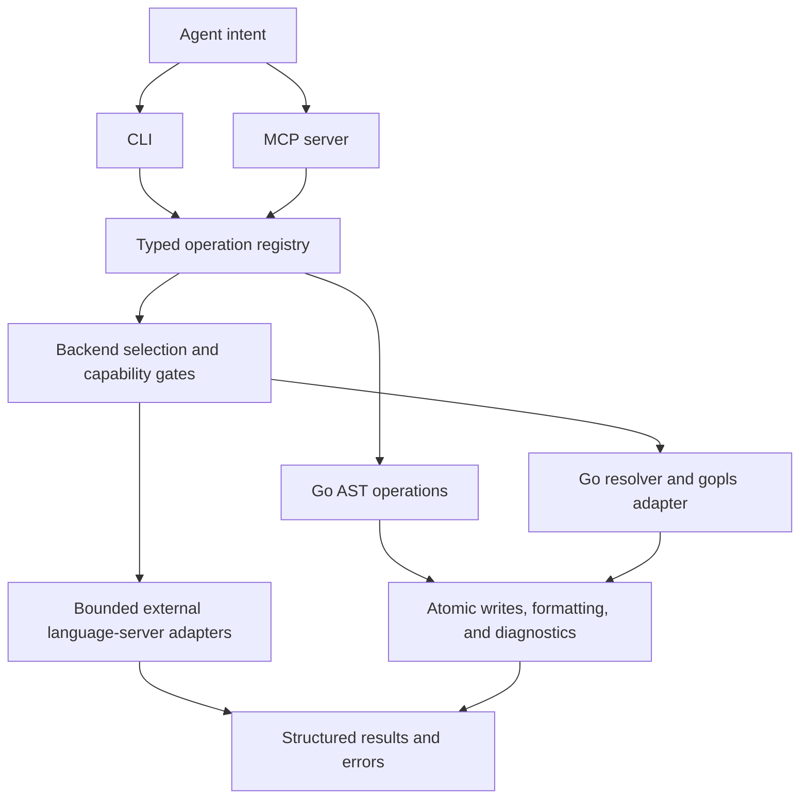

<!-- This README introduces the implemented product, evidence, and boundaries; detailed contracts live in the linked code and decision records. -->
# semantic-editor (`semedit`)

**Intent-driven code editing for AI agents: LLMs describe the change; local compiler, AST, and language-server tools perform the transformation.**

`semedit` exposes a command-line interface (CLI) and a Model Context Protocol (MCP) server. Go has the broadest editing support. Seven additional language backends provide explicitly bounded lookup, rename, or diagnostics capabilities.

The efficiency ambition remains **up to 100× fewer generated edit tokens and 10× faster execution** in favorable refactoring scenarios. These are analytical upper bounds we aim to approach. Current benchmarks demonstrate speed and token savings in individual cases; improved first-attempt correctness remains a goal.

## 1. Why semantic editing

A rename or declaration move can require a text-editing agent to read and reproduce code across many files. With semantic editing, the agent names the symbol and the intended change, and local tooling handles coordinates and mechanical edits.

```text
Agent intent → CLI or MCP → Registered operation → Language tooling → Result and diagnostics
```

This reduces generated diffs, repeated source reads, and opportunities for patch-application mistakes. Go symbol lookup uses Go's AST; other backends use native language-server symbols. A rename or move can reuse existing source without asking the model to reproduce it. Insertion and replacement still require the model to supply new source, and tool schemas, results, reasoning, and verification all contribute to total session cost.

Deterministic editing does not prove the agent chose the correct change. Operations can fail, language tools can time out, and an applied edit can introduce compiler diagnostics. The workflow exposes these outcomes so an agent can continue a multi-step refactoring.

## 2. Performance: ambition and measured evidence

### Analytical targets

The original multi-file refactoring model estimates the potential benefit of replacing repeated text-editing turns with a compact semantic request:

| Mechanism | Favorable analytical scenario | Target |
| :--- | :--- | :--- |
| Generated edit tokens | Roughly 2,000–3,000 diff tokens replaced by about 25 argument tokens for a rename | Up to 100× fewer output tokens |
| Remote turns and latency | A sequence of searches, reads, edits, and repairs replaced by one semantic request plus local execution | Up to 10× faster completion |
| Context reuse | Less repeated source and repair history in subsequent prompts | Lower context consumption and model cost |
| Edit reliability | Structural validation removes classes of malformed text patches | Fewer repair loops; improved first-attempt correctness remains to be demonstrated |

These are theoretical upper-bound scenarios, not average measured performance or guarantees. End-to-end results depend on task, model, harness, cache behavior, language-server startup, and verification cost. [RQ-0014](docs/research/RQ-0014-benchmarking-token-latency-and-eval-harness.md) and [RQ-0015](docs/research/RQ-0015-multi-dimensional-benchmark-matrix.md) track the broader evaluation.

### Measured results as of 2026-09-26

The generated benchmark documentation reports these three headline metrics for historical runs whose semedit restriction policy is recorded as `unspecified`:

| Measure | Result | Evidence |
| :--- | :--- | :--- |
| Best speed improvement | **56.9% less elapsed time**, about **2.32×** speedup | `task-07-generate-template-main`, standard small context, [Codex prescriptive run](data/benchmarks/results/run-20260924-codex-prescriptive/task-07-generate-template-main/) |
| Best token reduction | **87.5% fewer cache-adjusted token units** | `task-11-mixed-sink-api-migration`, standard small context, [Codex prescriptive run](data/benchmarks/results/run-20260924-codex-prescriptive/task-11-mixed-sink-api-migration/) |
| First-time right | **MCP 195/209 (93.3%) vs baseline 196/209 (93.8%)**, −0.5 percentage points | Initial correctness-oracle results across all publishable standard-context paired observations |

The speed and token figures are separate best cases where both the baseline and semedit arms passed their correctness oracle. They are not averages or necessarily the same model/task pair. Cache-adjusted token units are uncached input + visible output + reasoning + cached input / 10; they differ from the generated-output-token target above. The first-time-right comparison excludes verified/self-correction contexts and shows no improvement yet.

[ADR-0043](docs/adr/0043-benchmark-run-aggregation-and-best-case-publication.md) defines publication and selection rules. The generated site includes complete run evidence, aggregate ranges, and an interactive benchmark browser. Run `make docs` to generate it under `dist/docs/`; the underlying [run records](data/benchmarks/results/) remain available in the repository.

The harness now resolves one execution plan, retains every terminal job outcome, and distinguishes `read`, `write`, and `readwrite` semedit policies. New runs default to `write`; historical unspecified policies remain separate. Diagnostic questioning about tool use stays outside measured task tokens, time, turns, and correctness outcomes. See [ADR-0050](docs/adr/0050-benchmark-planning-sessions-and-arm-policy.md) and the [benchmark architecture guide](tools/benchmark-harness/README.md).

## 3. Current language support

Support is operation-specific. A shared interface does not imply that every language supports every edit.

| Language | Tooling | Implemented scope |
| :--- | :--- | :--- |
| **Go** | Go parser/AST, `gopls`, Go formatting/import tooling | Symbol lookup, workspace rename, construct insertion/replacement/movement, body and declaration replacement, scaffolding, imports, dependencies, assertion transforms, and verification |
| **Rust** | `rust-analyzer` | Trusted selected-file lookup and rename; edits outside the selected `.rs` file are rejected. No Cargo execution or general verification |
| **Java** | Eclipse JDT LS; separate bounded Maven actions | Trusted selected-file lookup, rename, formatting, import organization, and diagnostics; explicit Maven import; fixed Maven `test-compile` and `test` actions |
| **Scala** | Metals | Trusted selected-file lookup only; no build import or mutation |
| **Haskell** | Haskell Language Server and matching GHC | Explicitly standalone, trusted `.hs` lookup only; project cradles, compilation, and mutation are unavailable |
| **Kotlin** | `kotlin-language-server` | Trusted selected-file `.kt`/`.kts` lookup and diagnostics in a source-only scratch workspace; no mutation |
| **Bash** | `bash-language-server` | Trusted selected-file `.sh`/`.bash` lookup and diagnostics in a source-only scratch workspace; no mutation or script execution by the backend |
| **Makefile** | `make-ls` | Trusted selected-file target and assignment-variable lookup; no conditional-symbol lookup, diagnostics, mutation, or recipe execution by the backend |

External-tool backends require preinstalled tooling and explicit request-scoped workspace trust. Some require configured distribution paths and recorded runtime versions. Kotlin and Bash verification require an explicit matching diagnostics report; silence does not mean the file is clean. Scratch workspaces limit the copied source but are not an operating-system sandbox: external tools may perform additional reads or launch their own helpers after trust.

Java's JDT LS operations do not execute Maven or Gradle. Maven import requires explicit opt-in; the separate Maven commands run fixed goals against a trusted in-workspace root POM, with scratch-local state and offline mode by default. See [ADR-0035](docs/adr/0035-java-maven-import-boundary.md), [ADR-0036](docs/adr/0036-java-bounded-verify-actions.md), and [ADR-0037](docs/adr/0037-java-bounded-maven-actions.md).

Kotlin, Bash, and Makefile boundaries are documented in [ADR-0047](docs/adr/0047-kotlin-read-only-backend.md) and [ADR-0048](docs/adr/0048-bash-and-makefile-read-only-backends.md). TypeScript/JavaScript, Python, C#, Elixir, Elm, Dart, and C/C++ do not currently have registered runtime backends.

## 4. Editing operations

Registered semantic operations share CLI and MCP definitions. Use command help or the active MCP tool schema for exact parameters and language constraints.

| Intent | CLI command | MCP tool |
| :--- | :--- | :--- |
| Locate a symbol | `lookup` | `semantic_lookup` |
| Rename a symbol and supported references | `rename` | `semantic_rename` |
| Add a Go construct | `insert-construct` | `semantic_insert_construct` |
| Replace or upsert a Go construct | `replace-construct` | `semantic_replace_construct` |
| Move a Go declaration within a file | `move-construct` | `semantic_move_construct` |
| Replace a Go function or method body | `replace-body` | `semantic_replace_body` |
| Replace a Go constant, variable, or type alias declaration | `replace-decl` | `semantic_replace_decl` |
| Create a Go file with an inferred package | `scaffold-file` | `semantic_scaffold_file` |
| Organize Go imports | `organize-imports` | `semantic_organize_imports` |
| Add a Go module dependency | `add-build-dependency` | `semantic_add_build_dependency` |
| Change supported Go test assertion failure modes | `assertion-mode` | `semantic_assertion_mode` |
| Format/check supported sources | `verify` | `semantic_verify` |
| Compile or run Java tests | `maven-compile`, `maven-test` | `semantic_maven_compile`, `semantic_maven_test` |
| Capture or restore a workspace snapshot | `snapshot`, `undo` | `semantic_snapshot`, `semantic_undo` |

[ADR-0049](docs/adr/0049-ast-construct-taxonomy-and-mutation-lifecycle.md) separates the construct lifecycle:

* **Insert** creates a new construct at a chosen location and rejects declaration collisions. It cannot overwrite existing code.
* **Replace** changes a construct in place. Declaration upsert can insert an absent declaration at its canonical layout position; replacement has no placement parameter.
* **Move** relocates an existing declaration within its file, carrying attached comments without requiring its source again.

These operations currently execute Go edits. The broader construct taxonomy in the ADRs does not enable mutation in other languages. The former discrete insertion tools, including `insert-declaration`, `insert-function`, `insert-type`, `insert-decl`, and `insert-case`, have been retired from the registry.

The MCP-only `semantic_batch` runs registered edits sequentially against the supplied workspace, coalesces deferred formatting and diagnostics, and returns a final diff. Earlier successful edits remain applied if a later edit fails. CLI batch exposure remains an [open investigation](docs/research/RQ-0030-registry-backed-cli-batches.md).

`report_feedback` is a separate MCP utility that returns a structured issue draft for user review and manual posting. It does not save or submit the report. Development-only `semantic_reload` is available when the server starts with `--live-reload`.

## 5. Architecture and mutation boundaries

The implementation is Go-native. It combines Go AST transformations with adapters around external language tools; it does not implement a universal AST or its own typechecker.



[ADR-0021](docs/adr/0021-language-backend-service-boundary.md) defines the backend service boundary; [ADR-0034](docs/adr/0034-central-operation-registry.md) defines the operation registry. Language backends own their native lookup, trusted edit validation, and diagnostics. The MCP server publishes structured output schemas and timing metrics alongside human-readable results ([ADR-0042](docs/adr/0042-mcp-structured-tool-output-schemas.md)).

Source updates use atomic replacement and advancing timestamps. Edits may remain applied with compiler diagnostics so multi-step refactorings can pass through temporarily broken states. Snapshots provide explicit, conflict-checked undo. Direct batches do not provide transaction-wide rollback or an isolated working copy; callers own any workspace isolation they need. See [ADR-0010](docs/adr/0010-disk-synchronization-and-cache-invalidation.md), [ADR-0018](docs/adr/0018-transactional-snapshots-and-undo.md), and [ADR-0032](docs/adr/0032-direct-and-isolated-batch-execution.md).

Verification uses configured language servers and can write files: Go verification formats before collecting gopls diagnostics, and Java formatting/import modes mutate the selected file. `--check-only` skips normalization. Project-root `.semedit.yaml` hooks select additional normalization and checks; applicable golangci configuration automatically enables its filesystem check after edits are published. Bash and Make servers are selected automatically when matching sources and server executables are present; selected unsupported verification fails explicitly. See the [configuration contract](docs/research/RQ-0029-project-normalization-configuration.md) for overrides, scope, and supported actions. Workspace manifests such as `go.work` are not created or changed implicitly; explicit dependency operations can update `go.mod` and `go.sum`.

The original dual-engine design includes an error-tolerant CST fallback. Automatic routing to Tree-sitter, `ast-grep`, or Comby is not implemented. The current Go resolver uses `go/parser`, and Go edits use native AST tooling. There is no automatic discovery of another server's `gopls` MCP tools or short-circuit routing through that server.

## 6. Build and use

Use the Go version declared in [go.mod](go.mod), `make`, and the tools required by the selected backend. Go semantic rename requires `gopls`. Development checks also need the repository's configured formatters, linters, and Hugo tooling; see [CONTRIBUTING.md](CONTRIBUTING.md) and the [Makefile](Makefile).

```sh
make check
make build
./bin/semedit-next --help
./bin/semedit-next lookup --file main.go --symbol main
```

`make build` produces the development binary `bin/semedit-next`. `make promote` runs checks and promotes it to the stable `bin/semedit` used by long-lived integrations.

For a Go project, run the binary from the intended workspace and name the declaration rather than calculating coordinates:

```sh
semedit rename --file server.go --symbol Server.Start --to Serve
semedit replace-body --file server.go --symbol Server.Serve --body 'return nil'
```

The second example assumes `Server.Serve` returns an error. The replacement body contains statements without outer braces.

Start a stdio MCP server from the intended workspace:

```sh
semedit mcp --enabled-languages=go
```

`--profile=full` is the default; `--profile=mutations-only` omits lookup tools. `--enabled-languages` limits the exposed language set. Go subprocess state defaults to `.scratch/go` beneath the server working directory, with `--go-base-dir` available to select another location. Configure the client with the executable path and working directory explicitly. The [semedit steering skill](skills/semedit/SKILL.md) explains intent selection and operation boundaries.

## 7. Open research and future scope

The [ADR index](docs/adr/README.md) records accepted decisions and their evolution; the [research index](docs/research/README.md) tracks investigations. A resolved feasibility question does not necessarily mean its integration has shipped.

* **Broader refactoring support:** extraction, inlining, richer disambiguation, and additional language mutations remain future work. Bash and Makefile construct editing need parser evidence beyond language-server symbol ranges ([RQ-0024](docs/research/RQ-0024-ide-edit-and-refactoring-capability-taxonomy.md), [RQ-0037](docs/research/RQ-0037-bash-language-server-and-construct-editing.md), [RQ-0038](docs/research/RQ-0038-makefile-language-server-versus-parser.md)).
* **Post-edit context and normalization:** bounded result projections, project quality policy, and configurable normalization remain under investigation ([RQ-0027](docs/research/RQ-0027-preventing-read-files.md) through [RQ-0029](docs/research/RQ-0029-project-normalization-configuration.md)).
* **Benchmark integration:** native instruction-delivery channels have been identified, but the transport implementation described in [RQ-0039](docs/research/RQ-0039-benchmark-policy-instruction-transport.md) remains deferred. [ADR-0044](docs/adr/0044-benchmark-experiment-dimensions-and-result-semantics.md) remains proposed.
* **Runtime and workspace evolution:** persistent server lifecycle, caching, and broader workspace topologies remain research topics. Concurrent polyglot server orchestration and embedded speculative workspace isolation are not current features.

## 8. Requirements and invariant tests

The [active requirements catalog](docs/adr/README.md#active-requirements-invariants) is the project-level source of architectural invariants. Each requirement has a stable `REQ-NNN` identifier and links to the ADRs that define its scope. Treat these invariants as requirements, not as a complete description of the test suite.

Every active requirement MUST have at least one regression test that exercises the observable behavior. Make the link mechanically discoverable in one of two ways: include the exact requirement ID in the test or subtest name (for example, `TestREQ004AtomicMutation` or a txtar scenario named `req-006-rename-go`), or have the test case output record the requirement ID together with the observed and expected invariant value. Test names and output should identify the requirement directly; a prose-only mapping is not sufficient.

A test need not map to an invariant. Unit, property, integration, protocol-failure, regression, and benchmark tests may cover behavior outside the invariant catalog. Requirement coverage and overall suite size are different measures. A change that adds or changes an invariant MUST update its requirement entry and add or update its linked regression test in the same change.

Current test anchors use the requirement ID in the Go test name:

| Requirement | Regression test anchor |
| :--- | :--- |
| REQ-001 | [`TestREQ001SemanticIntentCLIContracts`](main_test.go) |
| REQ-002 | [`TestREQ002REQ006PublicRegistryAndCLIContractCoverage`](main_test.go) |
| REQ-003 | [`TestREQ003BackendRejectsUnsafeRenameWithoutWrite`](internal/backend/rust_test.go) |
| REQ-004 | [`TestREQ004WriteAtomicPreservesPermissionsAndAdvancesMtime`](internal/pipeline/pipeline_test.go), [`TestREQ004RenameReportsIntroducedDiagnostics`](internal/backend/backend_test.go) |
| REQ-005 | [`TestREQ005WorkspaceTrustRequiresExplicitCanonicalConsent`](internal/backend/backend_test.go) |
| REQ-006 | [`TestREQ002REQ006PublicRegistryAndCLIContractCoverage`](main_test.go) |
| REQ-007 | [`TestREQ007RunPhasePreservesHookOrderAndPartialFailure`](internal/projectverify/executor_test.go) |
| REQ-008 | [`TestREQ008LoadAllBenchmarkComparisonsExcludesIncompleteRuns`](cmd/docgen/benchmarks_test.go) |

## 9. Development and documentation

`make check` runs mechanical fixes, formatting, dependency tidying, linting, tests, and generated-documentation checks. Public semantic behavior is exercised through CLI [txtar contracts](testdata/scripts/), with comparable coverage for each implemented language-operation pair. Unit and property tests complement those contracts ([ADR-0028](docs/adr/0028-cross-language-cli-txtar-coverage.md)).

The Go documentation generator combines registry-derived capabilities, executable examples, and benchmark evidence into a Hugo/Hextra site. Start with [CONTRIBUTING.md](CONTRIBUTING.md) for development and [the benchmark architecture guide](tools/benchmark-harness/README.md) for benchmark changes.

## 10. Repository Layout

The main source, documentation, and test directories are:

```text
semedit/
├── main.go                 # Executable entry point for CLI and MCP modes
├── cmd/docgen/             # Documentation site and benchmark publication generator
├── internal/
│   ├── cli/                # CLI commands generated from the operation registry
│   ├── mcp/                # MCP server, tool schemas, and feedback reports
│   ├── operation/          # Shared operation definitions, dispatch, and batch execution
│   ├── capability/         # Language capability documentation contracts
│   ├── backend/            # Language-neutral service and language implementations
│   ├── backends/           # Default backend registration and runtime configuration
│   ├── adapters/golang/    # gopls integration and Go dependency operations
│   ├── astedit/            # Go AST construct insertion, replacement, and relocation
│   ├── symbol/             # Go AST symbol resolution
│   ├── lsp/                # Bounded stdio JSON-RPC transport for language servers
│   ├── pipeline/           # Atomic writes, formatting, and compiler diagnostics
│   ├── snapshot/           # Snapshot journal and conflict-checked undo
│   ├── maven/              # Bounded Java Maven verification actions
│   ├── integration/        # Agent harness installation and configuration
│   ├── gocache/            # Project-local Go runtime state
│   ├── telemetry/          # Operation timing and metrics
│   ├── assertmode/         # Go test assertion transformations
│   └── testtools/          # Shared test support
├── tools/benchmark-harness/ # Benchmark planning, execution, and correctness oracles
├── data/benchmarks/         # Benchmark run records and supporting data
├── testdata/
│   ├── scripts/            # CLI txtar contracts for public operations
│   ├── bench/              # Benchmark task fixtures
│   └── bench-oracles/      # Hidden benchmark acceptance tests
├── docs/
│   ├── adr/                # Architecture decisions and index
│   └── research/           # Research questions, findings, and index
├── skills/                 # Agent steering and documentation review skills
├── .github/                # CI and repository automation
├── Makefile                # Formatting, linting, tests, builds, and documentation checks
├── CONTRIBUTING.md         # Development workflow and test authoring guide
└── README.md
```
