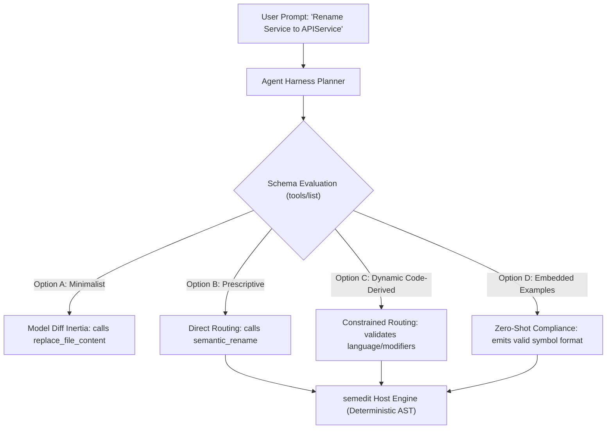

# RQ-0010: Agent Harness Integration Matrix, MCP Discovery Protocols & Steering Delivery

* **Status**: Open
* **Category**: Integration & Ecosystem
* **Last Updated**: 2026-09-16

---

## 1. Problem Context

Modern AI coding harnesses (Google Antigravity, Claude Code, Cursor, Windsurf, Continue, VS Code Copilot) standardize on the **Model Context Protocol (MCP)** for extending agent capabilities with external tools. Because MCP provides an abstraction over JSON-RPC transports, `semedit` avoids maintaining distinct graphical editor plugins for each vendor.

However, exposing a language refactoring engine to autonomous agent harnesses presents two architectural hurdles:

1. **Frontier Model Diff Inertia**:
   Frontier Large Language Models exhibit strong behavioral bias toward generating raw text search-and-replace patches (such as `replace_file_content`, `edit_file`, or unified diffs). Extensive pre-training on code commits and unified diff formats instills a default reaction to emit textual substitutions rather than invoking specialized semantic tools. When presented with refactoring tasks, unsteered models reflexively perform line-and-column coordinate hunting or pattern replacement, discarding compiler safety.

2. **Harness Configuration Divergence**:
   While the transport protocol (stdio MCP) remains uniform across platforms, agent harnesses diverge significantly in tool discovery processing, system prompt construction, dynamic instruction retrieval, and steering configuration. Each platform implements distinct mechanisms for:
   * Registering local MCP server processes.
   * Exposing tool schemas (`tools/list`) to the underlying model.
   * Distributing behavioral guidelines and domain rules (native skills, project rulebooks, system prompt injections).
   * Supporting dynamic MCP primitives such as Prompts (`prompts/list`) and Resources (`resources/list`).

To ensure that agent planners consistently route code mutations through deterministic compiler transformations, `semedit` must balance schema-level docstring design, dynamic capability advertising, and multi-channel instruction distribution.

---

## 2. Agent Harness Integration Matrix

The following matrix documents connection protocols, integration tiers, configuration locations, steering mechanisms, and dynamic MCP capability support across major agent harnesses:

| Agent Harness | Connection Protocol | Integration Tier | Registration Mechanism | Steering Configuration File | Activation / Injection Semantics | MCP Prompts & Resources Support |
| :--- | :--- | :---: | :--- | :--- | :--- | :---: |
| **Google Antigravity** | Stdio MCP | **Tier 1** | Project or user MCP config | `skills/semedit/SKILL.md` | On-demand skill activation via semantic intent matching; zero baseline token overhead during unrelated tasks. | Supported (`prompts/*`, `resources/*`) |
| **Claude Code** | Stdio MCP / CLI | **Tier 1** | `claude mcp add semedit -- semedit mcp` | `CLAUDE.md` (root or `~/.claude/CLAUDE.md`) | Injected into context at session launch; persists across all interactive conversational turns. | Partial (evaluates prompt templates; resources require explicit slash commands) |
| **Cursor** | Stdio MCP | **Tier 1** | Cursor Settings $\rightarrow$ MCP Server or `.cursor/mcp.json` | `.cursor/rules/semedit.mdc` (Cursor Rules 2.0) | Conditional injection via frontmatter file globs (`globs: ["*.go"]`); preserves tokens when editing non-target files. | Quiescent (primarily tool schema consumers; prompts/resources unsupported) |
| **Windsurf** | Stdio MCP | **Tier 1** | `~/.codeium/windsurf/mcp_config.json` | `.windsurfrules` | Injected into Cascade agent system prompt upon workspace initialization. | Quiescent (tools only) |
| **Continue.dev** | Stdio MCP | **Tier 1** | `~/.continue/config.json` (`mcpServers`) | `.continuerules` | Appended to agent context per turn; supports custom slash commands and prompt templates. | Supported (`prompts/*` exposed as slash commands) |
| **VS Code Copilot** | Stdio MCP | **Tier 1** | `.vscode/mcp.json` | `.github/copilot-instructions.md` | Injected into Chat participant context automatically during user interactions. | Emerging (supports tool calls; resources roll out incrementally) |
| **Aider** | CLI Subprocess | **Tier 2** | Wrapper invocation via `/run semedit ...` | `.aider.conf.yml` | Injected into system prompt via `--read` or `.aider.conf.yml` instructions. | Absent (lacks MCP daemon; relies on CLI binary) |

---

## 3. MCP Tool Discovery Protocol Documentation Strings (`tools/list`)

When an agent harness connects to `semedit`, it dispatches the `tools/list` JSON-RPC method. The server returns a list of tool objects containing `name`, `description`, and `inputSchema`. The harness transforms these JSON structures into the target model's tool-calling definitions (e.g., Anthropic Tools, Gemini Function Declarations, OpenAI Tool Schemas).

Because planner heuristics match user intentions against tool names and schema descriptions, docstring phrasing directly governs tool selection probability.



### Comparative Analysis of Tool Description Strategies

We evaluate four distinct design options for crafting tool descriptions within `tools/list`:

#### Option A: Minimalist & Concise Descriptions

* **Design**: Provide terse 1-sentence summaries highlighting basic input and output behavior.
  * *Example*: `"Renames an identifier using the host compiler."`
* **Token Footprint**: Minimal (~20-30 tokens per tool; ~250 tokens total across the full toolset).
* **Routing Behavior**: High failure rate. Frontier models frequently bypass the tool in favor of built-in file editing tools (`replace_file_content`, `edit_file`, `str_replace_editor`). Because the description omits explicit domain priority and trigger boundaries, the model treats the semantic tool as an optional auxiliary utility rather than the primary mutation path.
* **Assessment**: Inadequate for overcoming model diff inertia.

#### Option B: Prescriptive Steering Docstrings

* **Design**: Formulate explicit trigger criteria, assert active priority over generic text editing tools, and declare deterministic host engine guarantees.
  * *Example*: `"Use this tool instead of replace_file_content or edit_file whenever renaming an identifier, function, method, type, or package across one or more files. Executes deterministically via the host compiler/LSP without coordinate hunting; updates all reference sites and adjusts imports automatically."`
* **Token Footprint**: Moderate (~70-95 tokens per tool; ~750-950 tokens total across the full toolset).
* **Routing Behavior**: Exceptionally high routing precision. The affirmative statement establishes clear operational boundaries and triggers model attention during planning. It actively counteracts pre-training diff inertia by providing explicit instructions that supersede generic file editors for the specific domain.
* **Assessment**: Highly effective baseline strategy for all Tier 1 harnesses.

#### Option C: Dynamic Code-Derived Capability Strings

* **Design**: The server inspects workspace runtime capabilities (registered language backends, detected compiler toolchains, supported access modifiers from `LanguageBackend.SupportedAccessModifiers()`, supported placement anchors) and dynamically generates description strings and schema constraints during `tools/list`.
  * *Example (in Go workspace)*: `"Use this tool instead of replace_file_content when inserting functions into Go source files. Supported access modifiers: infer, public, private. Automatically clusters methods near receiver types and enforces public vs private section partitioning."`
  * *Example (in Java/TypeScript workspace)*: `"Use this tool instead of replace_file_content when inserting methods. Supported access modifiers: infer, public, private, protected, package-private."`
* **Token Footprint**: Calibrated (~75-110 tokens per tool). Context expenditure reflects only active workspace capabilities.
* **Routing Behavior**: Prevents invalid parameter emissions before execution. Models avoid passing unsupported modifiers (e.g., passing `protected` to Go) because the schema description dynamically limits the declared vocabulary to the active backend.
* **Assessment**: Superior architecture for multi-language backends and evolving compiler capabilities.

#### Option D: Embedded Schema Examples

* **Design**: Supplement parameter schemas with concrete usage examples, utilizing the JSON Schema `examples` field alongside embedded syntactic patterns in property descriptions:

```json
{
  "symbol": {
    "type": "string",
    "description": "Target symbol identifier. Concrete examples: 'Server.Start', '(*Client).Do', 'ValidateToken', 'Config'.",
    "examples": ["Server.Start", "ValidateToken", "(*Client).Do"]
  }
}
```

* **Token Footprint**: Moderate-high (+30-50 tokens per tool; ~1,100-1,400 tokens total).
* **Routing Behavior**: Eliminates formatting ambiguity. Models adhere to expected symbol qualification patterns without prior trial-and-error turns.
* **Client Compatibility Caveat**: Certain harnesses strip non-standard JSON schema fields before transmitting declarations to the model API. Placing concrete examples directly inside the parameter `description` text guarantees cross-harness delivery across all platforms.
* **Assessment**: Strongly recommended for complex parameter schemas (`symbol`, `placement`, `add` imports).

---

### Best Practices for Parameter-Level Descriptions

Parameter descriptions must resolve syntactic ambiguities upfront:

1. **`symbol`**:
   * State expected identifier formats explicitly across all declaration kinds.
   * Provide concrete exemplars: receiver methods (`Server.Start`), pointer receiver methods (`(*Server).Start`), standalone functions (`ValidateToken`), types (`ConfigService`), and variables (`DefaultTimeout`).
   * State that the resolver automatically disambiguates methods across distinct types when qualified with receiver names.

2. **`file`**:
   * Clarify that the parameter accepts both workspace-relative paths (`internal/server/http.go`) and absolute paths.
   * For mutation tools (`semantic_rename`), document that `file` serves as an optional scope disambiguator when multiple unexported declarations share an identical name.
   * For insertion tools (`semantic_insert_function`), document that `file` identifies the exact target file receiving the new code.

3. **`access_modifier`**:
   * Explicitly enumerate supported options (`infer`, `public`, `private`, `protected`, `package-private`).
   * Document default behavior: `"infer"` derives visibility from target language idioms (identifier casing in Go, explicit keyword defaults in Java).
   * Note that invalid modifiers trigger informative validation errors showing supported alternatives.

4. **`placement`**:
   * Enumerate discrete placement anchors (`file_start`, `file_end`, `public_start`, `public_end`, `private_start`, `private_end`, `before_symbol`, `after_symbol`).
   * Explicitly document parameter dependencies: setting `placement` to `before_symbol` or `after_symbol` requires supplying `target_symbol`.

5. **`auto_organize_imports`**:
   * Formulate the description affirmatively: `"Automatically resolve missing package imports and remove unused imports following the AST transformation (default true)."`

---

## 4. Overcoming Model Diff Inertia

Frontier LLMs exhibit "diff inertia" due to the overwhelming presence of line-based diffs, patch files, and search/replace edits in pre-training corpora. When tasked with refactoring, models default to textual replacements even when semantic tools reside in the tool registry.

```text
Model Diff Inertia Trajectory:
[User: "Rename X to Y"] ──> [LLM Prior: Diff Generation] ──> [Emits replace_file_content]
                                                                      │
                                                           Compiler errors, broken call sites,
                                                           line drift, coordinate hunting
```

### Affirmative Linguistic Steering

Negative constraints ("DO NOT use replace_file_content", "NEVER edit files directly for renames") frequently fail under complex reasoning chains because generative models process negative instructions with lower compliance than positive commands.

We apply affirmative framing across tool descriptions, skill documents, and steering files:

* **Active Priority**: Assert the affirmative operational boundary:
  *"Prioritize `semedit` semantic tools (`semantic_rename`, `semantic_insert_function`, `semantic_organize_imports`) for all AST-level symbol transformations and code organization."*
* **Domain Boundary Delineation**: Delineate exactly when fallback tools apply:
  *"Reserve text-replacement tools (`replace_file_content`, `edit_file`) exclusively for non-code assets, Markdown documentation, raw comments, or unparseable scratch files."*
* **Active Capability Highlighting**: Emphasize unique capabilities that text diff tools cannot match:
  *"Semantic tools execute deterministically on the AST, update multi-file reference sites simultaneously, resolve imports automatically, format code to repository standards, and report compiler diagnostic deltas without coordinate hunting."*

### Prompt-Token Cost vs. Tool-Routing Precision

Injecting behavioral steering rules introduces a per-turn context overhead:

$$\text{Total Session Overhead} = N_{\text{turns}} \times M_{\text{tokens}}$$

* **Global Rulebook Injection** (e.g., 2,000-token `CLAUDE.md` or `.continuerules`):
  * In a 40-turn conversation, a 2,000-token steering block consumes 80,000 prompt tokens.
* **Concise Schema Docstrings** (Option B/C in `tools/list`):
  * Consumes ~800 tokens total across the tool registry.
  * Injects tool definitions natively into the model's tool schema block without duplicating instructions in conversational memory.
* **On-Demand Skill Loading** (Antigravity Skills & Cursor MDC Globs):
  * Consumes 0 tokens during general conversational turns or non-target file edits.
  * Dynamically loads a rich 400-token steering skill only when the user requests refactoring or navigates to relevant source files.

We adopt a **tiered instruction architecture**:

1. **Tier 1 (Schema Level)**: Prescriptive tool descriptions in `tools/list` provide immediate, zero-config routing precision across all platforms.
2. **Tier 2 (On-Demand Skills)**: Platform-specific skill files provide deep architectural guidance and workflow recipes only when active.
3. **Tier 3 (Workspace Rules)**: Terse 150-token global steering blocks establish domain boundaries without bloating prompt token consumption.

---

## 5. Instruction & Bundled Skills Distribution Architecture

To deliver consistent agent behavior across heterogeneous environments, `semedit` defines four complementary distribution channels:

```mermaid
flowchart LR
    subgraph SemeditEngine["semedit Core Delivery"]
        Binary["semedit Binary"]
        MCPDaemon["semedit mcp (Stdio Server)"]
    end

    subgraph Channels["Distribution Channels"]
        C1["Channel 1: Workspace Skills (skills/semedit/SKILL.md)"]
        C2["Channel 2: Dynamic MCP Endpoints (prompts/*, resources/*)"]
        C3["Channel 3: Platform Steering Files (CLAUDE.md, .cursor/rules, .windsurfrules)"]
        C4["Channel 4: Scaffolding CLI (semedit init --harness <type>)"]
    end

    subgraph Harnesses["Supported Harnesses"]
        H1["Google Antigravity"]
        H2["Claude Code"]
        H3["Cursor"]
        H4["Windsurf & Continue"]
        H5["VS Code Copilot"]
    end

    Binary --> C4
    MCPDaemon --> C2
    C4 --> C1
    C4 --> C3
    C1 --> H1
    C2 --> H1
    C2 --> H4
    C3 --> H2
    C3 --> H3
    C3 --> H4
    C3 --> H5
```



### Channel 1: Workspace-Level Skills (`skills/semedit/SKILL.md`)

* **Target Harnesses**: Google Antigravity, skill-compatible agent architectures.
* **Structure**: A self-contained directory containing `SKILL.md` with structured YAML frontmatter:

  ```yaml
  ---
  name: semedit
  description: Use when refactoring, renaming, or querying symbols in Go and polyglot codebases. Prioritize over replace_file_content for deterministic compiler-backed AST transformations.
  ---
  ```

* **Advantages**:
  * Native discovery in Antigravity: the planner inspects the description and activates the skill dynamically upon receiving refactoring intents.
  * Zero baseline token footprint during editing of non-code or unassociated tasks.
  * Bundles complete decision trees, parameter formulation guidelines, and dogfooding instructions (`semedit` vs `semedit-next`).

### Channel 2: Native MCP Prompts & Resources (`prompts/list`, `resources/list`)

The Model Context Protocol specification establishes first-class primitives for distributing instructions and contextual documents directly over JSON-RPC:

1. **MCP Resources (`resources/list`, `resources/read`)**:
   `semedit mcp` exposes structured refactoring guides under a dedicated URI scheme:
   * `semedit://guides/refactoring`: Comprehensive architectural guide and decision tree for semantic code transformations.
   * `semedit://skills/rename`: Operational guide covering symbol disambiguation, cross-package propagation, and diagnostic delta analysis.
   * `semedit://skills/insert`: Guide detailing placement qualifiers (`public_end`, `before_symbol`), access modifiers, and receiver clustering.
   * `semedit://capabilities`: Machine-readable JSON summary of active language backends, compilers, and supported syntax features.

2. **MCP Prompts (`prompts/list`, `prompts/get`)**:
   `semedit mcp` publishes pre-packaged prompt templates that harnesses can execute as slash commands or workflow templates:
   * `semantic_refactor`: Accepts arguments `symbol`, `action`, and `target`, expanding into a structured refactoring plan.
   * `organize_workspace`: Prepares a comprehensive workspace import and cleanup execution turn.

3. **Dynamic Ingress Advantages**:
   * Eliminates configuration drift: when users upgrade the `semedit` binary, updated guides and prompt templates become active immediately without modifying repository files.
   * Harnesses supporting MCP resources retrieve reference material on-demand via standard protocol calls.

### Channel 3: Platform-Specific Steering Files

For harnesses that read static workspace files rather than dynamic MCP resources, `semedit` targets their canonical configuration formats:

* **Claude Code (`CLAUDE.md`)**:
  Appends a standardized 10-line block establishing tool precedence and directing renames to `semantic_rename`.
* **Cursor (`.cursor/rules/semedit.mdc`)**:
  Leverages Cursor Rules 2.0 with frontmatter matching:

  ```markdown
  ---
  description: Prioritize semedit semantic tools for AST code modifications
  globs: ["*.go", "*.java", "*.ts"]
  alwaysApply: false
  ---
  ```

  This restricts rule injection strictly to relevant file extensions.
* **Windsurf (`.windsurfrules`)**:
  Injects domain boundaries into Cascade's workspace rule memory.
* **VS Code Copilot (`.github/copilot-instructions.md`)**:
  Establishes participant-level instructions for GitHub Copilot Chat.
* **Continue.dev (`.continuerules`)**:
  Configures model guidance for Continue's context assembly.

### Channel 4: Automated Scaffolding CLI (`semedit init`)

To eliminate manual configuration errors across diverse harnesses, `semedit` provides a unified initialization command:

```bash
semedit init --harness <antigravity|claude|cursor|windsurf|continue|copilot|all>
```

#### Operational Responsibilities of `semedit init`

1. **MCP Server Registration**:
   * For Cursor: Injects the `semedit` stdio server entry into `.cursor/mcp.json`.
   * For Claude Code: Executes `claude mcp add semedit -- semedit mcp` or updates `~/.claude/mcp.json`.
   * For Windsurf: Updates `~/.codeium/windsurf/mcp_config.json`.
   * For VS Code: Updates `.vscode/mcp.json`.
2. **Steering File Placement**:
   * Scaffolds the corresponding rule file (`skills/semedit/SKILL.md`, `.cursor/rules/semedit.mdc`, `CLAUDE.md`, etc.).
   * Preserves existing user rules by appending rather than overwriting existing configurations.
3. **Execution Flags**:
   * `--dry-run`: Prints proposed configuration diffs to stdout without modifying disk files.
   * `--force`: Overwrites existing `semedit` configuration blocks with updated defaults.
   * `--profile <full|mutations-only>`: Selects the initial MCP toolset profile (ADR-0009).

---

## 6. Comparative Evaluation Matrix

We compare the four instruction delivery channels across key operational dimensions:

| Dimension | Channel 1: Workspace Skills (`SKILL.md`) | Channel 2: Dynamic MCP Endpoints (`prompts/*`, `resources/*`) | Channel 3: Platform Steering Files (`.mdc`, `CLAUDE.md`) | Channel 4: Scaffolding CLI (`semedit init`) |
| :--- | :--- | :--- | :--- | :--- |
| **Primary Strength** | On-demand activation; rich multi-page guidance; native to Antigravity. | Zero-drift synchronization with binary version; protocol-native. | Immediate support across current production IDEs (Cursor, Windsurf, Claude). | One-command setup; configures both transport registration and rules. |
| **Token Cost per Turn** | Zero quiescent cost; loaded only when triggered (~400 tokens). | Zero prompt cost until requested via resource read (~300 tokens). | Persistent context cost (~150-250 tokens per turn unless glob-gated). | One-time setup utility (zero runtime prompt token cost). |
| **Inertia Resistance** | High (provides complete workflow decision trees). | Moderate (requires harness to read resources proactively). | High (injects direct priority rules into agent system prompt). | Indirect (installs channels 1, 2, and 3). |
| **Harness Portability** | Antigravity and skill-aware architectures. | Harnesses supporting full MCP 2024-11-05 resource/prompt specifications. | Broadest compatibility across current commercial harnesses. | Universal (generates platform-specific configs). |
| **Maintenance Burden** | Requires keeping workspace skill file updated upon tool additions. | Low; bundled directly inside the `semedit` binary. | Requires maintaining separate template variants for each platform. | Centralizes all template generation within the Go CLI codebase. |

---

## 7. Universal Steering Rule Template

The standardized steering block injected across platform-specific rule files follows strict affirmative framing:

```markdown
# Semantic Code Transformation Rules

Prioritize `semedit` semantic tools over manual file replacement tools (`replace_file_content`, `edit_file`) for all AST-level modifications:

- **Symbol Renaming**: Use `semantic_rename` for functions, methods, types, and variables. This updates all workspace references and cleans imports deterministically.
- **Function & Method Insertion**: Use `semantic_insert_function` to insert new functions and methods. This clusters methods near receiver types and enforces public/private section boundaries.
- **Type Insertion**: Use `semantic_insert_type` to declare structs, interfaces, and type aliases.
- **Declaration & Constant Merging**: Use `semantic_insert_decl` to add constants or variables; merges into existing `const (...)` or `var (...)` blocks automatically.
- **Import Management**: Use `semantic_organize_imports` to resolve missing packages and remove unused imports.
- **Verification**: Use `semantic_verify` to format code and inspect compiler diagnostics across the workspace.

Reserve text replacement tools (`replace_file_content`) exclusively for non-code assets, Markdown documentation, raw comments, or unparseable scratch files.
```

---

## 8. Open Research Questions

1. **RQ-0010.1: Dynamic Schema Generation Latency**:
   * *Question*: Does dynamic runtime capability introspection during `tools/list` introduce perceptible latency when an agent harness reconnects frequently?
   * *Investigation Path*: Benchmark `tools/list` JSON serialization overhead with cached vs dynamically assembled language backend metadata.

2. **RQ-0010.2: Cross-Harness MCP Resource Subscription Adoption**:
   * *Question*: When will mainstream IDE harnesses (Cursor, Claude Code, Windsurf) support automatic resource subscription (`resources/subscribe`) to pull agent guides dynamically without static steering files?
   * *Investigation Path*: Monitor MCP client roadmap releases across Anthropic, Codeium, and Cursor.

3. **RQ-0010.3: Few-Shot Example Retention Across Reasoning Models**:
   * *Question*: How effectively do reasoning models (o1, Claude 3.7 Thinking, Gemini 2.0 Flash Thinking) attend to schema-level parameter examples compared to standard instruction-tuned models?
   * *Investigation Path*: Run benchmark evaluations measuring symbol qualification accuracy with schema examples vs system-prompt examples.

4. **RQ-0010.4: Coexistence with Overlapping LSP-MCP Servers**:
   * *Question*: When an agent harness connects both `semedit` and a language-specific LSP server (e.g. `gopls mcp`), how do descriptive docstrings influence tool disambiguation when both declare rename operations?
   * *Investigation Path*: Cross-reference with ADR-0009 and RQ-0013; evaluate planner routing under conflicting tool names (`rename` vs `semantic_rename`).

---

## 9. Concrete Implementation Recommendations

Based on the comparative findings, we recommend the following phased implementation roadmap for `semedit`:

1. **Phase 1: Upgrade `tools/list` Docstrings (Immediate)**:
   * Adopt **Option B (Prescriptive Steering Docstrings)** combined with **Option C (Dynamic Backend Capabilities)** in `internal/mcp/server.go`.
   * Embed concrete symbol qualification patterns directly in the `symbol` parameter description.
   * Ensure affirmative framing across all tool docstrings.

2. **Phase 2: Implement MCP Prompts and Resources (Protocol Completeness)**:
   * Implement `resources/list` and `resources/read` handlers in `internal/mcp/server.go`, exposing `semedit://guides/refactoring` and `semedit://skills/rename`.
   * Implement `prompts/list` and `prompts/get` handlers in `internal/mcp/server.go`, providing the `semantic_refactor` template.

3. **Phase 3: Implement `semedit init` CLI Command (Ecosystem Ergonomics)**:
   * Create `cmd/init.go` using the Cobra framework (ADR-0014).
   * Implement automated registration and steering file generation for `antigravity`, `claude`, `cursor`, `windsurf`, `continue`, `copilot`, and `all`.
   * Provide `--dry-run` and `--force` support.

4. **Phase 4: Maintain Synchronized Skill & Rule Templates**:
   * Maintain `skills/semedit/SKILL.md` as the canonical reference template.
   * Run automated markdownlint and vale verification in CI (`make lint-markdown`, `make lint-vale`) across all bundled guides and templates.

---

## 10. Sources & Prior Art

* **Model Context Protocol Specification (2024-11-05)**: [modelcontextprotocol.io](https://modelcontextprotocol.io) - Specifications for Tools, Resources, and Prompts.
* **Anthropic Claude Code MCP Documentation**: [Claude Code Architecture](https://docs.anthropic.com/en/docs/agents-and-tools/claude-code) - Local tool integration and `CLAUDE.md` memory.
* **Cursor Rules 2.0 Specification**: [Cursor Rules Documentation](https://docs.cursor.com/context/rules-for-ai) - File-glob scoped rules (`.mdc`).
* **Google Antigravity Customization Architecture**: [Antigravity Skills & MCP Reference](https://cloud.google.com) - Intent-triggered skill routing and stdio MCP daemon mechanics.
* **GitHub Copilot Custom Instructions**: [GitHub Copilot Documentation](https://docs.github.com/en/copilot) - `.github/copilot-instructions.md` context injection.
