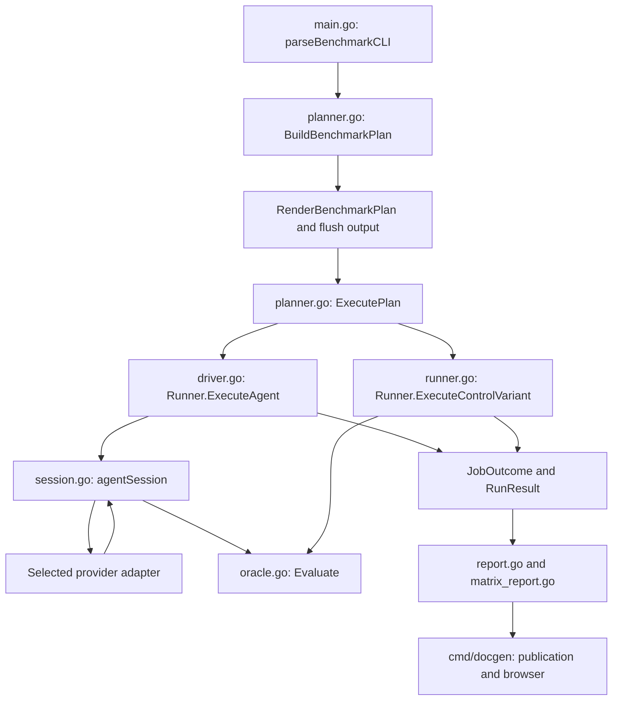

# Benchmark harness architecture

Start here when changing the benchmark harness. This guide maps the current implementation to its responsibilities, contracts, and regression tests. Update it when ownership or entry points move. [ADR-0050](../../docs/adr/0050-benchmark-planning-sessions-and-arm-policy.md) records the accepted design and invariants; this file records where to implement them.

## Execution flow

All benchmark runs follow the same planning and scheduling path. Listing, fixture extraction, and standalone oracle evaluation are command-line utilities outside that execution path.



`main.go:executeBenchmarkPlan` connects these components. Read that function first to trace a complete invocation. For an individual agent job, continue at `driver.go:Runner.ExecuteAgent`. The `task-00-hi-overhead` fixture has no source files and uses `disallowed_files: ["*"]` to require no workspace changes. The `task-12-rename-scale-*` fixtures measure 1, 2, 4, 8, and 16 coordinated method renames under one task contract. Compare paired arms within each edit count; the no-op probe is an overhead diagnostic, not the intercept of an edit-count fit.

## Where to change what

Paths in this table are relative to this directory unless they start with `../../`.

| Change | Start here | Responsibility and nearby checks |
| :--- | :--- | :--- |
| CLI flags, defaults, utility dispatch, or output destinations | [main.go](main.go): `parseBenchmarkCLI`, `runPlannedCLI`, `executeBenchmarkPlan` | Translate user input into `PlanOptions`, print the plan before execution, and save terminal results. Process-level contracts are in [cli_integration_test.go](cli_integration_test.go). |
| Make variables and forwarded flags | [Makefile](Makefile) | Both `bench` and `bench-all` use the same CLI path. Forward `SEMEDIT_ARM_RESTRICT`, defaulting to `write`. Check the Make tests in `cli_integration_test.go`. The root Makefile includes this file. |
| Fixture selection, context compatibility, prompt expansion, pairing, job identities, exclusions, or plan display | [planner.go](planner.go): `BuildBenchmarkPlan`, `RenderBenchmarkPlan` | Load fixtures, normalize selections, and create all jobs and resolved prompts once. See [planner_test.go](planner_test.go). |
| Concurrency, cancellation, per-job timeout, completion output, or failed-job accounting | [planner.go](planner.go): `ExecutePlan` | Scheduling currently shares this file with planning. It consumes existing jobs, fills terminal result metadata, emits completion order, and returns plan order. See [scheduler_test.go](scheduler_test.go). |
| Restriction values and semantic-arm steering | [session_policy.go](session_policy.go): `ParseSemeditArmRestriction`, `ResolveAgentExecution`, `semeditRestrictionSteering` | Resolve initial and follow-up prompts centrally. Base prompt assembly and fixture mutation guidance remain in [driver.go](driver.go). See [session_policy_test.go](session_policy_test.go) and CLI policy-isolation tests. |
| MCP server instruction mode matrix | [runner.go](runner.go): `ParseMCPServerInstructionModes`; [planner.go](planner.go): `normalizePlanOptions`, `makePlannedJobs` | Expand each selected server instruction mode into independent paired agent jobs with mode-specific identities. Deterministic control jobs remain single. See `planner_test.go` and `cli_integration_test.go`. |
| Agent lifecycle and measurement boundaries | [driver.go](driver.go): `Runner.ExecuteAgent`, `mergeTurn`, `requestSemanticToolReflection` | Orchestrate setup, task turns, oracle checks, task metric finalization, and optional diagnostic questioning. See [session_test.go](session_test.go). |
| Workspace ownership, original snapshot, continuation state, transcript recording, or follow-up sequencing | [session.go](session.go): `agentSession`, `runTurn`, `runFollowups`, `evaluate`, `close` | One session owns mutable state and one selected adapter. Cleanup retains evidence outside the task workspace. See `session_test.go`. |
| Provider process arguments, environment, event parsing, tool outcomes, or provider diagnostics | [codex_driver.go](codex_driver.go), [agy_driver.go](agy_driver.go), [opencode_driver.go](opencode_driver.go) | Keep protocol details in the matching driver. Adapter selection and Agy's cumulative-observation cursor live in `session.go`. See [bench_test.go](bench_test.go) and `session_test.go`. |
| Target syntax or a pinned model catalog | [target.go](target.go), [openrouter.go](openrouter.go) | Parse harness/model/effort and expand the explicitly selected catalog. See [target_test.go](target_test.go), [openrouter_test.go](openrouter_test.go), and [the OpenRouter guide](../../docs/benchmark-openrouter.md). |
| Result fields, tool telemetry types, runner options, or deterministic control execution | [runner.go](runner.go): `RunResult`, `ToolCall`, `Runner`, `ExecuteControlVariant` | Shared runtime data and control execution. A serialized field change also needs review of `report.go` and the docgen read model. |
| Fixture metadata, extraction, mutation guards, hidden tests, or acceptance evaluation | [oracle.go](oracle.go): `TaskMetadata`, `ParseTask`, `ExtractVariantTo`, `Evaluate` | [txtar.go](txtar.go) wraps archive parsing; [large_overlay.go](large_overlay.go) supplies supported large-context overlays. Inputs live in [testdata/bench](../../testdata/bench), with some script fixtures also usable as benchmarks. See `bench_test.go` and planner context tests. |
| Extraction/evaluation utility behavior | [extract.go](extract.go), [evaluate_cmd.go](evaluate_cmd.go) | Utility entry points used by `main.go:runFixtureUtility`; they reuse fixture and oracle logic. |
| Harness JSON, duration units, comparison slots, or Markdown reports | [report.go](report.go): `BenchmarkReport.MarshalJSON`, `BuildComparisons`, `SaveReport` | Build policy-specific comparisons and serialize the versioned result format. See [report_test.go](report_test.go). |
| Per-fixture result directories, filenames, or source provenance | [matrix_report.go](matrix_report.go): `saveMatrixReports` | Persist grouped reports without merging different policies or distinct planned fixtures. The filename is historical; there is no separate matrix executor. |
| Published eligibility, best-case selection, aggregate metrics, or browser columns | [cmd/docgen](../../cmd/docgen/benchmarks.go) | Follow the publication map below. Changes here affect claims made from results, not execution. See [benchmarks_test.go](../../cmd/docgen/benchmarks_test.go). |

## Contracts and state ownership

`PlanOptions` contains invocation settings. `BenchmarkPlan` contains normalized options, loaded jobs, and explicit fixture exclusions. Each `Job` identifies one task, target, arm, context, prompt, and repeat; agent jobs also carry their resolved `AgentExecution`. Execution must consume these jobs without rediscovering fixtures or expanding another matrix.

`JobExecutor` is the scheduler's provider-neutral execution boundary. `JobOutcome` retains the job, result, and execution error. Every scheduled job gets one terminal outcome, including setup failure and queued cancellation. Live output follows completion order; returned results follow plan order. A timeout covers the whole job, including follow-ups, rather than restarting for each turn.

`agentSession` owns the workspace, snapshot, selected `providerAdapter`, resume identifier, transcript, start time, measured result, and retention decision. `Runner.ExecuteAgent` provides lifecycle orchestration; session methods run follow-ups, evaluate results, and clean up. A provider adapter handles one turn and continuation mechanics. It does not decide whether the oracle requires a corrective attempt.

`RunResult` holds normalized task measurements. `InteractionStep` records individual task attempts. `sessionTurn` records classified transcript evidence, including diagnostic turns, provider errors, and raw events. The transcript path is retained in provenance and lives under the runner's `transcripts` directory outside the disposable workspace.

## Measurement and policy boundaries

The measured lifecycle is initial task answer, oracle evaluation, and declared corrective follow-ups with oracle evaluation after each. Follow-ups stop on success or terminal failure. Hidden oracle output never becomes agent steering.

Failed or exhausted task attempts do not trigger diagnostic reflection. The result retains the last oracle and task measurements and records why reflection was skipped.

An optional `oracle.diagnostic_expected_tools` list adds informational tool-use coverage to a result. Expected and observed names are normalized across provider prefixes, and observations include selections from every measured task turn even when the selected call failed. Diagnostic reflection calls are excluded. A batch call counts only as `semantic_batch`; it does not imply that any individual tool was observed. `observation_state` and `complete` describe capture quality, while `expected_satisfied` reports positively observed expected tools. The harness emits `missing` only after complete capture; unknown or partial capture retains positive observations without making absence claims. Tool-use coverage never changes oracle pass/fail. Codex capture is complete only after a clean stream containing `turn.completed`; OpenCode and Agy remain unknown until their terminal telemetry contracts are validated.

Task elapsed time is finalized before optional diagnostic questioning. A non-use or batching reflection runs through the same adapter with a fresh result and the `diagnostic_reflection` classification. Its explanation may be retained; its tokens, tools, turns, elapsed time, and oracle effects must not enter task totals, serialized benchmark metrics, or publication aggregates. Never merge a reflection result through `mergeTurn`.

Agy transcript reads are cumulative. Its session adapter advances a cursor and returns only new observations, including after a failed resume. A regressed transcript must not reintroduce old calls into task totals. Missing transcripts, invalid streaming records, and transcript-write failures remain explicit errors. Missing evidence is not a successful zero-tool measurement. Keep raw evidence and normalized observations distinct when changing a parser.

The selected `read`, `write`, or `readwrite` policy is a comparison condition on both agent arms, but steering applies only to semedit. `Job.Policy` describes semedit applicability; `AgentExecution.Policy` carries the selected agent condition. Terminal `RunResult.SemeditArmRestrict` records the condition, and `SemeditArmRestrictionApplied` records applicability. Direct control has no restriction condition. All policies permit shell builds and tests. `--mcp-server-instructions` accepts a comma-separated list of `none`, `descriptive`, and `prescriptive`; each mode creates a separate paired agent cell, and control jobs run once.

Policy changes must remain consistent across planning, prompts, result metadata, comparison keys, filenames, and publication. Historical results without policy metadata remain `unspecified`; the new-run default `write` must not be applied to them. Planned results retain exact fixture task identities, while legacy results retain their established normalization.

## Publication map

The publisher is a separate Go command, so its JSON read model is separate from the harness runtime types. Trace [benchmarks.go](../../cmd/docgen/benchmarks.go): `renderBenchmarkDocumentation` when a result is recorded correctly but displayed or grouped incorrectly.

| File in `cmd/docgen` | Responsibility |
| :--- | :--- |
| [benchmark_model.go](../../cmd/docgen/benchmark_model.go) | Read-side result, comparison, and publication structures. |
| [benchmark_load.go](../../cmd/docgen/benchmark_load.go) | Load saved runs and normalize supported duration formats. |
| [benchmark_publish.go](../../cmd/docgen/benchmark_publish.go) | Publication eligibility, ordering, and source provenance. |
| [benchmark_compare.go](../../cmd/docgen/benchmark_compare.go) | Pair selection, ranking, cost calculations, and aggregate condition identities. |
| [benchmark_best.go](../../cmd/docgen/benchmark_best.go) | Best-case pages, first-attempt rates, corrective-turn histograms, and policy-separated headlines. |
| [benchmark_render.go](../../cmd/docgen/benchmark_render.go) | Published comparison tables, prompts, and diagnostic explanations. |
| [benchmark_aggregate.go](../../cmd/docgen/benchmark_aggregate.go) | Browser row flattening, paired deltas, filters, and grouping. Excludes diagnostic reflection objects from metric rows. |

For a new experiment dimension, trace it from `PlanOptions` and `Job` through result serialization and every publication grouping key. For a new metric, establish its measurement boundary and missing-value semantics before updating both result models and rendering paths.

## Verification and related decisions

Follow the repository workflow: run `make check` before targeted verification and again before completion. Focused commands, after that prerequisite, are:

```sh
go test ./tools/benchmark-harness
go test ./cmd/docgen
```

Use fake provider processes for routine regressions. `cli_integration_test.go` proves that the complete plan precedes execution and that all three policies isolate baseline behavior. `scheduler_test.go` proves completion accounting and ordering. `session_test.go` exercises process continuation, cumulative transcript failures, evidence recording, and reflection exclusion. Parser-only tests cannot establish those lifecycle properties. `report_test.go` and docgen tests cover serialization and policy-separated publication.

Consult the [ADR index](../../docs/adr/README.md) before opening a decision. The relevant contracts are ADR-0038 (conditions and provenance), ADR-0039 (validity and telemetry), ADR-0040 (fixture/oracle isolation), ADR-0041 (process environment), ADR-0043 (publication), and ADR-0050 (planning, sessions, and arm policy). ADR-0044 remains a proposal. Record a new accepted architectural decision when changing these boundaries, and update its index in the same change.
